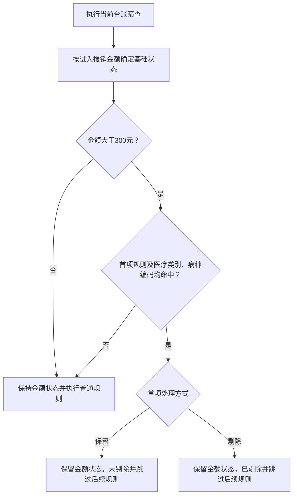

# 未救助台账用户操作与核对参考文档

更新时间：2026-08-03

这份文档给业务用户使用，按当前系统最新功能整理。所有导入文件目前只支持 `.csv`，系统会自动识别 UTF-8、GBK/GB18030 编码。导入、筛查、导出等耗时操作都会进入任务中心，提交后请先查看任务中心结果，再回到页面核对数据。

## 一、先记住六个原则

1. 未救助台账现在包含三个业务节点：`未救助明细`、`应补应退明细`、`下放通知`。
2. `未救助明细` 和 `应补应退明细` 只负责导入、匹配、筛查、筛选和导出排查结果，不再直接办理镇街通知流程。
3. 下放、接收、通知、反馈回填、管理员备注、报销标记统一在 `下放通知` 节点办理。
4. 附件2《救助对象名单》用于匹配镇街、村社和身份类别；未救助明细和应补应退明细各自独立导入附件2。
5. 筛查只标记 `已剔除/未剔除`，不会删除原始记录；导出明细一般以 `未剔除` 数据作为后续人工核对基础。
6. 每次操作前先确认清算期，导入、筛查、导出都按清算期生效。

## 二、按角色查看用户操作泳道图

| 阶段 | 管理员 | 系统/任务中心 | 镇街账号 | 线下核对人员 |
| :--- | :--- | :--- | :--- | :--- |
| 1. 基础准备 | 维护镇街、账号所属镇街、重大疾病编码 | 保存基础配置和权限范围 | 确认账号能进入本镇街业务菜单 | 提供镇街口径、重大疾病编码和核对模板 |
| 2. 未救助明细排查 | 选择清算期，导入附件1和附件2，配置并执行筛查 | 先按金额分档，仅金额大于300元时匹配门诊重大疾病，再执行后续筛查并刷新统计 | 不参与导入和筛查 | 按导出未救助明细继续核对疑点数据 |
| 3. 应补应退明细排查 | 选择清算期，导入附件4和附件2，配置并执行独立筛查 | 先按金额分档，仅金额大于300元时匹配门诊重大疾病，再执行正负抵消等本台账规则 | 不参与导入和筛查 | 按导出应补应退明细继续核对应补应退数据 |
| 4. 形成通知名单 | 将人工核对后需要通知的数据导入下放通知 | 按清算期和序号新增或更新通知明细，匹配镇街 | 暂不可见待下放数据 | 确认哪些数据进入通知、下放和后续拨付流程 |
| 5. 下放与接收 | 按镇街下放通知明细，必要时撤销未接收数据 | 记录下放状态、下放时间和可见范围 | 确认接收本镇街已下放数据 | 配合确认镇街接收范围是否正确 |
| 6. 通知与反馈 | 查看进度，填写管理员备注 | 保存通知状态、反馈信息和操作记录 | 标记通知或撤销通知，回填联系人、电话、账户、镇街备注 | 线下联系群众，收集账户和佐证材料 |
| 7. 报销与归档 | 按实际拨付结果标记已报销或恢复未报销，按需导出通知明细 | 写入报销状态、报销时间并生成导出文件 | 查看本镇街可见结果，按需导出 | 核对拨付名单、报销结果和归档材料 |

### 筛查固定首项规则流程图

未救助明细和应补应退明细分别保存自己的筛查配置；修改其中一个台账的规则，不会改变另一个台账。

## 三、第一步：维护基础数据

### 1. 维护镇街

入口：`系统管理 -> 镇街管理`

作用：

- 附件2和下放通知导入时，根据镇街名称或编码匹配系统镇街。
- 下放通知按镇街下放，必须能匹配到镇街。
- 镇街账号只能处理自己绑定镇街的数据。

需要重点核对：

| 配置项 | 核对方式 |
| :--- | :--- |
| 镇街名称 | 要和导入文件里的镇街名称能对应 |
| 镇街编码 | 如果导入文件使用编码，编码必须准确 |
| 用户所属镇街 | 镇街账号要绑定正确镇街 |

如果导入后很多记录没有镇街，优先检查镇街名称、编码和用户绑定关系。

### 2. 维护重大疾病编码

入口：`未救助台账 -> 重大疾病编码`

来源：附件3《救助重大疾病编码》

作用：

- 已启用的病种编码会在两个台账执行筛查时由首项规则自动精确匹配。
- 系统页面支持新增、编辑、删除和 CSV 导入重大疾病编码。

需要重点核对：

| 配置列 | 核对方式 |
| :--- | :--- |
| 病种编码 | 与医保就诊明细中的病种编码一致 |
| 病种名称 | 便于人工核对 |
| 状态 | 启用的数据才作为有效配置 |

## 四、未救助明细业务流程

入口：`未救助台账 -> 未救助明细`

主流程：

1. 选择清算期。
2. 导入附件1《未救助明细》。
3. 导入附件2《救助对象名单》。
4. 配置并执行筛查。
5. 导出未救助明细表。
6. 线下或内网系统继续人工核对，需下放通知的数据再导入 `下放通知`。

### 1. 导入附件1未救助明细

入口：`未救助明细 -> 导入 -> 导入附件1未救助明细`

操作：

1. 选择清算期，例如 `202602`。
2. 上传附件1 CSV。
3. 提交后到任务中心查看是否成功。
4. 回到未救助明细页，核对统计卡片和列表。

附件1会写入：

| 字段 | 来源或计算方式 |
| :--- | :--- |
| 序号 | 附件1序号，同一清算期内按序号更新 |
| 姓名、身份证号 | 附件1对应字段 |
| 医疗类别、病种编码、病种名称 | 附件1对应字段 |
| 认定地、医药机构名称、医药机构编码、市内外 | 附件1对应字段 |
| 入院时间、出院时间、结算时间 | 附件1对应字段 |
| 医疗总费用、医保政策范围费用 | 附件1对应金额 |
| 统筹报销金额、大额报销、大病报销 | 附件1对应金额 |
| 已使用门诊/普通住院/重特大疾病/大额费用住院救助金额 | 附件1对应金额 |
| 进入报销金额 | 医保政策范围费用 - 统筹报销金额 - 大额报销 - 大病报销 |

状态判断：

| 条件 | 状态 |
| :--- | :--- |
| 进入报销金额 <= 0 | 无救助金额 |
| 0 < 进入报销金额 <= 300 | 拟通知1 |
| 进入报销金额 > 300 | 拟通知2 |

导入更新规则：

| 情况 | 结果 |
| :--- | :--- |
| 同一清算期第一次出现该序号 | 新增记录 |
| 同一清算期已存在该序号 | 更新原记录 |
| 记录已是已下放、已接收、已通知 | 再次导入附件1不覆盖这些流程状态 |
| 附件1没有序号 | 跳过该行 |

核对重点：

1. 当前记录数是否接近附件1有效行数。
2. 抽查进入报销金额是否按公式计算正确。
3. `无救助金额`、`拟通知1`、`拟通知2` 数量是否符合预期。
4. 医疗类别筛选项是否出现附件1里的主要类别。

### 2. 导入附件2救助对象名单

入口：`未救助明细 -> 导入 -> 导入附件2救助对象名单`

前提：当前清算期必须已经导入附件1。

附件2按 `清算期 + 身份证号` 匹配附件1主表，同一身份证可能匹配多条就医记录。

附件2会写入：

| 字段 | 来源 |
| :--- | :--- |
| 镇街 | 附件2镇街名称或编码匹配系统镇街 |
| 村社 | 附件2村社 |
| 身份类别 | 附件2优先身份、医疗救助身份、救助身份、对象类别等字段 |
| 姓名 | 附件1姓名为空或为 `--` 时，用附件2姓名补齐 |
| 匹配状态 | 匹配到主表后为 `已匹配`，否则保持 `未匹配` |

导入后会重新计算待处理类状态，但不会覆盖已经进入 `已下放`、`已接收`、`已通知` 的记录。

核对重点：

1. 抽查几个身份证，确认镇街、村社、身份类别是否补齐。
2. 没有匹配镇街的记录，要检查附件2镇街名称和镇街管理里的名称/编码。
3. 如果整份文件效果异常，优先检查清算期、附件1是否已导入、身份证号码是否一致。
4. 身份类别筛选项是否出现附件2里的主要身份。

### 3. 配置并执行筛查

入口：`未救助明细 -> 筛查规则`

筛查规则按表格顺序执行，第一项优先级最高：

| 规则 | 结果 |
| :--- | :--- |
| 门诊重大疾病匹配（固定首项） | 仅进入报销金额大于300元的记录参与匹配；医疗类别命中配置（默认 `门诊慢特病`、`造口袋门诊`），且病种编码精确命中指定编码（默认 `M00500`）或重大疾病编码库中已启用的编码时，默认保留且不再执行后续规则，也可配置为剔除；金额状态不被覆盖 |
| 医疗类别不在保留范围内 | 已剔除 |
| 医药机构名称命中剔除关键字 | 已剔除 |
| 统筹报销金额 = 医保政策范围费用 | 已剔除，备注无救助金额 |
| 大额报销 = 医保政策范围费用 | 已剔除，备注无救助金额 |
| 大病报销 = 医保政策范围费用 | 已剔除，备注无救助金额 |
| 普通住院救助额度已满 | 已剔除 |
| 重特大疾病救助额度已满 | 已剔除 |
| 大额费用住院救助额度已满 | 已剔除 |
| 身份类别命中剔除范围 | 已剔除 |

执行筛查：

1. 确认当前清算期。
2. 检查当前台账筛查规则是否为本次业务口径。
3. 首先确认“门诊重大疾病匹配”的医疗类别、指定病种编码和处理方式；重大疾病编码库会自动匹配启用项，无需另开开关。
4. 至少启用一条筛查规则。
5. 点击执行筛查并提交任务。
6. 任务完成后回到列表核对统计和筛查命中规则。

核对重点：

1. 已剔除数量是否符合规则预期。
2. 抽查已剔除记录，命中规则和备注是否合理。
3. 抽查未剔除记录，确认没有明显应剔除但未剔除的数据。
4. 金额小于等于300元的记录不得命中首项；金额大于300元且命中首项时，配置“保留”应为 `未剔除`，配置“剔除”应为 `已剔除`。
5. 筛查规则改动后，需要重新执行筛查，旧结果才会刷新。

### 4. 导出未救助明细表

入口：`未救助明细 -> 导出`

导出口径：当前筛选条件下 `未剔除` 的未救助明细数据。

导出后到任务中心下载。导出前建议先确认清算期、镇街、剔除状态、匹配状态等筛选条件。

## 五、应补应退明细业务流程

入口：`未救助台账 -> 应补应退明细`

主流程：

1. 选择清算期。
2. 导入附件4《应补应退明细》。
3. 导入附件2《救助对象名单》。
4. 配置并执行筛查。
5. 导出应补应退明细表。
6. 线下或内网系统继续人工核对，需下放通知的数据再导入 `下放通知`。

### 1. 导入附件4应补应退明细

入口：`应补应退明细 -> 导入 -> 导入附件4应补应退明细`

附件4会写入：

| 字段 | 来源或计算方式 |
| :--- | :--- |
| 序号 | 附件4序号；没有序号时按行号生成 |
| 姓名、身份证号、镇街 | 附件4对应字段 |
| 参保地、参加险种 | 附件4对应字段 |
| 医疗机构、医疗类别、疾病编码、疾病名称 | 附件4对应字段 |
| 入院时间、出院时间、结算时间 | 附件4对应字段 |
| 总费用、医保政策范围费用 | 附件4对应金额 |
| 统筹报销金额、大额报销、大病报销 | 附件4对应金额 |
| 医疗救助金额、渝快保报销金额 | 附件4对应金额 |
| 个人账户支付金额、个人现金支付金额 | 附件4对应金额 |
| 进入报销金额 | 医保政策范围费用 - 统筹报销金额 - 大额报销 - 大病报销 - 医疗救助金额 - 渝快保报销金额 |

状态判断同未救助明细：

| 条件 | 状态 |
| :--- | :--- |
| 进入报销金额 <= 0 | 无救助金额 |
| 0 < 进入报销金额 <= 300 | 拟通知1 |
| 进入报销金额 > 300 | 拟通知2 |

核对重点：

1. 当前记录数是否接近附件4有效行数。
2. 抽查进入报销金额是否额外扣除了医疗救助金额和渝快保报销金额。
3. 同一清算期同一序号再次导入会更新原记录。

### 2. 导入附件2救助对象名单

入口：`应补应退明细 -> 导入 -> 导入附件2救助对象名单`

前提：当前清算期必须已经导入附件4。

附件2按 `清算期 + 身份证号` 匹配应补应退主表，写入镇街、村社、身份类别和匹配状态。一个身份证可更新多条应补应退就医记录。

核对重点：

1. 匹配状态是否从 `未匹配` 更新为 `已匹配`。
2. 镇街为空时，检查附件2镇街字段和镇街管理配置。
3. 身份类别为空时，检查附件2身份字段和表头。

### 3. 配置并执行筛查

入口：`应补应退明细 -> 筛查规则`

应补应退明细有自己独立的筛查配置。它同样把“门诊重大疾病匹配”放在第一项，且仅金额大于300元时参与匹配，并额外包含：

| 规则 | 结果 |
| :--- | :--- |
| 总费用正负抵消 | 同一清算期 + 同一身份证号 + 总费用绝对值相同的正负记录成对剔除 |
| 医疗救助金额大于 0 | 已剔除，备注已享受医疗救助 |

执行筛查：

1. 确认当前清算期。
2. 检查应补应退筛查规则，不要把它与未救助明细的配置混用。
3. 确认首项重大疾病规则的处理方式和条件。
4. 点击执行筛查并提交任务。
5. 任务完成后核对剔除数量、优先保留数量、保留数量和筛查命中规则。

核对重点：

1. 正负抵消规则只剔除可成对抵消的记录；多出来的正数或负数会保留。
2. 医疗救助金额大于 0 的记录是否按业务口径剔除。
3. 命中首项重大疾病规则且处理方式为“保留”的记录，不能再被正负抵消、医疗救助金额大于 0 或其他后续规则剔除。
4. 筛查后导出的数据是否只保留需要继续核对的记录。

### 4. 导出应补应退明细表

入口：`应补应退明细 -> 导出`

导出口径：当前筛选条件下 `未剔除` 的应补应退明细数据。

导出后到任务中心下载。导出前建议确认清算期、镇街、剔除状态、匹配状态等筛选条件。

## 六、下放通知业务流程

入口：`未救助台账 -> 下放通知`

主流程：

1. 管理员导入通知明细。
2. 管理员按镇街下放。
3. 镇街账号接收。
4. 镇街通知群众并回填反馈信息。
5. 管理员填写备注、标记报销状态。
6. 按需导出通知明细。

### 1. 导入通知明细

入口：`下放通知 -> 导入`

通知明细一般来自未救助明细、应补应退明细导出后的线下人工核对结果。系统导入时按清算期和序号新增或更新。

通知明细会写入：

| 字段 | 来源或计算方式 |
| :--- | :--- |
| 序号、姓名、身份证号 | 导入文件对应字段 |
| 镇街 | 导入文件镇街字段匹配系统镇街 |
| 对象类别/优先身份 | 导入文件对应字段 |
| 参保地、参加险种、医疗机构、医疗类别 | 导入文件对应字段 |
| 疾病编码、疾病名称、入院/出院/结算时间 | 导入文件对应字段 |
| 总费用、政策范围费用、统筹/大额/大病报销 | 导入文件对应金额 |
| 医疗救助金额、渝快保报销金额 | 导入文件对应金额 |
| 个人账户支付金额、个人现金支付金额 | 导入文件对应金额 |
| 系统备注 | 导入文件备注、剔除备注或系统备注字段 |
| 参考进入报销金额 | 政策范围费用 - 统筹报销 - 大额报销 - 大病报销 - 医疗救助金额 - 渝快保报销金额 |

导入后初始状态为 `待下放`，报销状态默认为 `未报销`。

核对重点：

1. 导入后统计中的 `待下放` 数量是否符合本次通知明细。
2. 镇街为空的数据不能成功下放，需要先修正镇街字段或镇街基础数据。
3. 管理员列表可查看参考进入报销金额和管理员备注；镇街列表不展示这些管理员侧字段。

### 2. 下放和撤销下放

管理员入口：`下放通知 -> 下放`

下放规则：

| 条件 | 结果 |
| :--- | :--- |
| 状态为待下放且镇街在本次选择范围内 | 状态变为已下放 |
| 镇街未匹配 | 不下放，并提示未匹配镇街数量 |
| 状态已接收或已通知 | 不能撤销下放 |
| 状态为已下放且尚未接收 | 可撤销为待下放 |

核对重点：

1. 下放前按清算期确认待下放总数。
2. 分镇街下放时，确认选择的镇街完整。
3. 撤销下放只适合尚未被镇街接收的数据。

### 3. 镇街接收

镇街账号入口：`未救助台账 -> 下放通知`

镇街账号进入页面后，如果当前清算期存在 `已下放` 未接收数据，先确认接收。

接收后：

- 状态从 `已下放` 变为 `已接收`。
- 写入接收时间。
- 镇街列表展示本镇街 `已接收`、`已通知` 数据。

核对重点：

1. 镇街账号必须绑定镇街，否则无法接收。
2. 镇街看不到其他镇街数据。
3. 如果镇街看不到数据，先确认是否已经接收、清算期是否正确、账号绑定镇街是否正确。

### 4. 通知、撤销通知和反馈回填

镇街线下通知群众后，在页面标记通知状态。

| 操作 | 状态变化 |
| :--- | :--- |
| 标记通知 | 已接收 -> 已通知 |
| 撤销通知 | 已通知 -> 已接收 |

镇街可对 `已接收`、`已通知` 数据回填：

- 联系人
- 联系电话
- 开户行
- 户名
- 银行账号
- 镇街备注

核对重点：

1. 已通知记录应有线下通知依据。
2. 需要后续拨款或报销的数据，开户行、户名、账号要尽量补齐。
3. 镇街备注用于记录无法联系、资料异常等现场情况。

### 5. 管理员备注和报销标记

管理员可在下放通知中填写管理员备注，并在报销或拨付完成后标记报销状态。

报销状态：

| 操作 | 结果 |
| :--- | :--- |
| 标记已报销 | 报销状态变为已报销，并写入报销时间 |
| 恢复未报销 | 报销状态变为未报销，并清空报销时间 |

核对重点：

1. 标记前先按清算期、镇街、报销状态筛选。
2. 标记已报销前，核对实际拨款或报销名单。
3. 不要把尚未完成拨款的数据提前标记为已报销。

### 6. 导出通知明细

入口：`下放通知 -> 导出`

导出口径：当前筛选条件下的通知明细；镇街账号导出时系统自动限制为本镇街可见数据。

导出前建议确认清算期、镇街、状态、报销状态、医疗类别、身份类别和关键词筛选。

## 七、常见问题核对

### 1. 为什么状态是“无救助金额”

通常原因：

1. 进入报销金额 <= 0。
2. 统筹、大额、大病等报销已经覆盖政策范围费用。
3. 金额列格式异常，导致解析后金额不符合预期。

处理方式：

1. 抽查政策范围费用和各项报销金额。
2. 按对应公式手算进入报销金额。

### 2. 为什么状态是“拟通知1”或“拟通知2”

系统按进入报销金额自动分档：

| 金额范围 | 状态 |
| :--- | :--- |
| 0 < 进入报销金额 <= 300 | 拟通知1 |
| 进入报销金额 > 300 | 拟通知2 |

这两个状态只用于排查和核对，不代表已经下放或通知。

### 3. 为什么附件2导入后镇街为空

通常原因：

1. 附件2镇街名称与系统镇街名称不一致。
2. 附件2使用了镇街编码，但镇街管理里未维护编码。
3. 附件2表头不符合模板，镇街列没有被识别。

处理方式：

1. 回到镇街管理检查名称和编码。
2. 抽查附件2对应行的镇街字段。
3. 修正后重新导入附件2。

### 4. 为什么附件2导入后身份类别为空

通常原因：

1. 附件2没有对应身份证。
2. 附件2身份类别列为空。
3. 附件2表头不符合模板。
4. 清算期选错，导致没有匹配到当前清算期主表数据。

### 5. 为什么筛查后数据被剔除或不能被后续规则剔除

通常原因：

1. 医疗类别不在保留范围。
2. 医药机构名称命中剔除关键字。
3. 报销金额已经达到规则中的剔除条件。
4. 身份类别命中剔除范围。
5. 应补应退中存在总费用正负抵消或医疗救助金额大于 0。
6. 门诊重大疾病首项规则的处理方式被配置为“剔除”。

处理方式：

1. 查看记录的筛查命中规则和备注。
2. 仅进入报销金额大于300元的记录可能命中“门诊重大疾病匹配”；命中后保留金额分档状态并跳过后续规则，处理方式为“保留”时不能被后续规则剔除。
3. 如果规则口径不对，修改当前台账的筛查规则后重新执行筛查。

### 6. 为什么下放通知不能下放

通常原因：

1. 记录不是 `待下放`。
2. 没有匹配到镇街。
3. 选择的镇街不包含这条记录所属镇街。
4. 当前账号是镇街账号，不允许下放。

### 7. 为什么镇街账号看不到通知数据

通常原因：

1. 管理员还没有下放。
2. 镇街还没有确认接收。
3. 用户没有绑定镇街。
4. 账号绑定镇街和记录镇街不一致。
5. 清算期选错。

### 8. 为什么导出数量和页面总数不一样

通常原因：

1. 页面当前筛选条件和导出时筛选条件不同。
2. 未救助明细、应补应退明细导出默认要求有未剔除数据。
3. 镇街账号导出时会自动限制本镇街可见数据。
4. 清算期、状态或报销状态筛选未清空。

## 八、推荐核对流程

1. 镇街管理确认镇街名称、编码、镇街账号绑定正确。
2. 重大疾病编码确认当前有效编码已维护。
3. 在未救助明细选择清算期，导入附件1，核对记录数、进入报销金额、状态分布。
4. 在未救助明细导入附件2，核对镇街、村社、身份类别和匹配状态。
5. 执行未救助明细筛查，先抽查重大疾病首项规则，再抽查已剔除和未剔除记录。
6. 导出未救助明细表，交由线下或内网系统继续核对。
7. 在应补应退明细导入附件4，核对进入报销金额是否扣除医疗救助金额和渝快保报销金额。
8. 在应补应退明细导入附件2，核对镇街和身份匹配。
9. 执行应补应退筛查，先确认首项保留记录未被后续规则剔除，再核对正负抵消和医疗救助金额大于 0 的剔除结果。
10. 导出应补应退明细表，交由线下或内网系统继续核对。
11. 将最终需要通知的数据导入下放通知。
12. 管理员按镇街下放，镇街接收、通知并回填反馈。
13. 管理员核对反馈和实际拨款情况后，标记报销状态并按需导出通知明细。

## 九、镇街账号能做什么

镇街账号只能看和处理本镇街数据。

建议开放：

- 下放通知查看
- 下放通知接收
- 通知和撤销通知
- 反馈信息回填
- 本镇街通知明细导出

不建议开放：

- 未救助明细和应补应退明细导入
- 筛查规则配置和执行
- 重大疾病编码维护
- 下放和撤销下放
- 管理员备注
- 报销标记

镇街账号进入页面后，系统会自动限制为本镇街数据。
