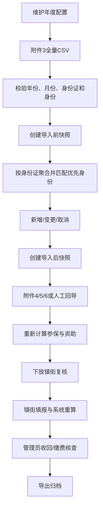
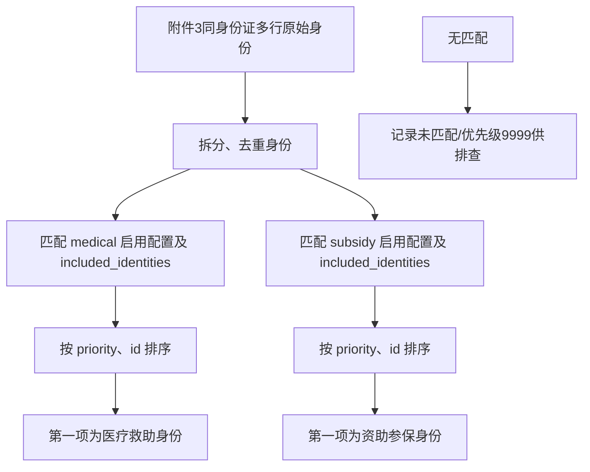
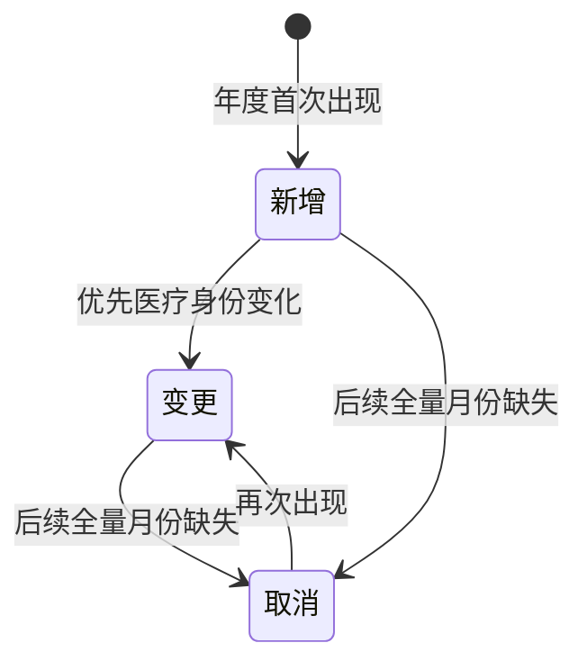
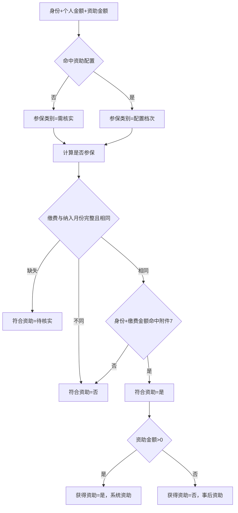
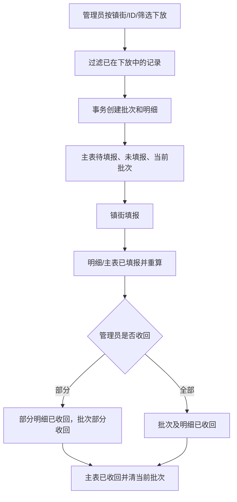
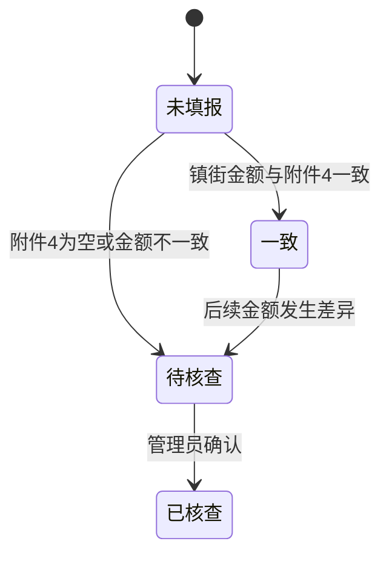

# 参保台账业务流程图解

## 总流程

```mermaid
flowchart TD
    A["维护年度配置"] --> B["附件3全量CSV"]
    B --> C["校验年份、月份、身份证和身份"]
    C --> D["创建导入前快照"]
    D --> E["按身份证聚合并匹配优先身份"]
    E --> F["新增/变更/取消"]
    F --> G["创建导入后快照"]
    G --> H["附件4/5/6或人工回导"]
    H --> I["重新计算参保与资助"]
    I --> J["下放镇街复核"]
    J --> K["镇街填报与系统重算"]
    K --> L["管理员收回/缴费核查"]
    L --> M["导出归档"]
```

## 身份优先级

```mermaid
flowchart TD
    A["附件3同身份证多行原始身份"] --> B["拆分、去重身份"]
    B --> C["匹配 medical 启用配置及 included_identities"]
    B --> D["匹配 subsidy 启用配置及 included_identities"]
    C --> E["按 priority、id 排序"]
    D --> F["按 priority、id 排序"]
    E --> G["第一项为医疗救助身份"]
    F --> H["第一项为资助参保身份"]
    I["无匹配"] --> J["记录未匹配/优先级9999供排查"]
```

## 附件3月度变化

```mermaid
stateDiagram-v2
    [*] --> 新增: 年度首次出现
    新增 --> 变更: 优先医疗身份变化
    变更 --> 取消: 后续全量月份缺失
    新增 --> 取消: 后续全量月份缺失
    取消 --> 变更: 再次出现
```

同月重复导入且身份不变时保持原变化状态。

## 计算

```mermaid
flowchart TD
    A["身份+个人金额+资助金额"] --> B{"命中资助配置"}
    B -- "否" --> C["参保类别=需核实"]
    B -- "是" --> D["参保类别=配置档次"]
    C --> E["计算是否参保"]
    D --> E
    E --> F{"缴费与纳入月份完整且相同"}
    F -- "缺失" --> G["符合资助=待核实"]
    F -- "不同" --> H["符合资助=否"]
    F -- "相同" --> I{"身份+缴费金额命中附件7"}
    I -- "是" --> J["符合资助=是"]
    I -- "否" --> H
    J --> K{"资助金额>0"}
    K -- "是" --> L["获得资助=是，系统资助"]
    K -- "否" --> M["获得资助=否，事后资助"]
```

## 下放与收回

```mermaid
flowchart TD
    A["管理员按镇街/ID/筛选下放"] --> B["过滤已在下放中的记录"]
    B --> C["事务创建批次和明细"]
    C --> D["主表待填报、未填报、当前批次"]
    D --> E["镇街填报"]
    E --> F["明细/主表已填报并重算"]
    F --> G{"管理员是否收回"}
    G -- "部分" --> H["部分明细已收回，批次部分收回"]
    G -- "全部" --> I["批次及明细已收回"]
    H --> J["主表已收回并清当前批次"]
    I --> J
```

## 缴费核查

```mermaid
stateDiagram-v2
    [*] --> 未填报
    未填报 --> 一致: 镇街金额与附件4一致
    未填报 --> 待核查: 附件4为空或金额不一致
    一致 --> 待核查: 后续金额发生差异
    待核查 --> 已核查: 管理员确认
```

