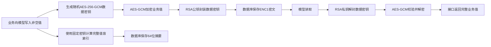
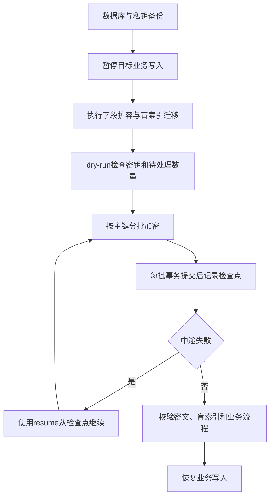

# 业务敏感数据加密流程图解

## 写入与读取

```mermaid
flowchart LR
    A["业务向模型写入非空值"] --> B["生成随机AES-256-GCM数据密钥"]
    B --> C["AES-GCM加密业务值"]
    C --> D["RSA公钥封装数据密钥"]
    D --> E["数据库保存ENC1密文"]
    A --> F["使用固定密钥计算完整值盲索引"]
    F --> G["数据库保存64位摘要"]
    E --> H["模型读取"]
    H --> I["RSA私钥解封数据密钥"]
    I --> J["AES-GCM校验并解密"]
    J --> K["接口返回完整业务值"]
```

## 精确查询

```mermaid
flowchart LR
    A["用户输入完整姓名或证件号"] --> B["规范化输入"]
    B --> C["计算HMAC盲索引"]
    C --> D["查询对应bidx列"]
    D --> E["模型解密命中记录"]
    E --> F["页面显示完整值"]
```

## 老数据升级

```mermaid
flowchart TD
    A["数据库与私钥备份"] --> B["暂停目标业务写入"]
    B --> C["执行字段扩容与盲索引迁移"]
    C --> D["dry-run检查密钥和待处理数量"]
    D --> E["按主键分批加密"]
    E --> F["每批事务提交后记录检查点"]
    F --> G{"中途失败"}
    G -- "是" --> H["使用resume从检查点继续"]
    G -- "否" --> I["校验密文、盲索引和业务流程"]
    H --> E
    I --> J["恢复业务写入"]
```
