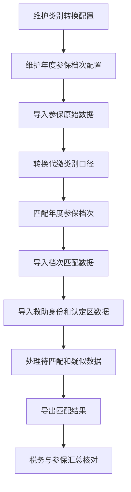
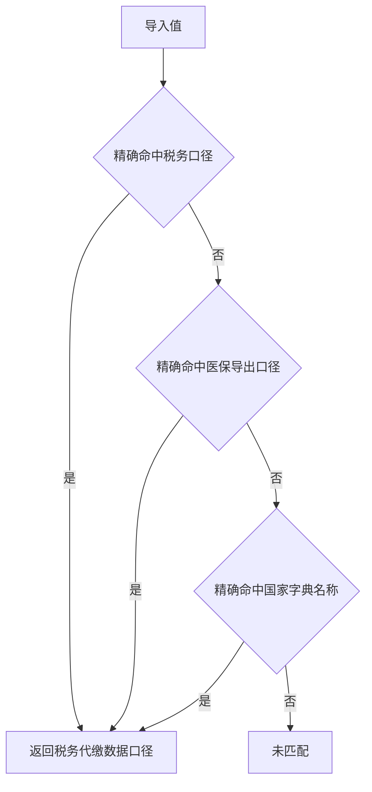
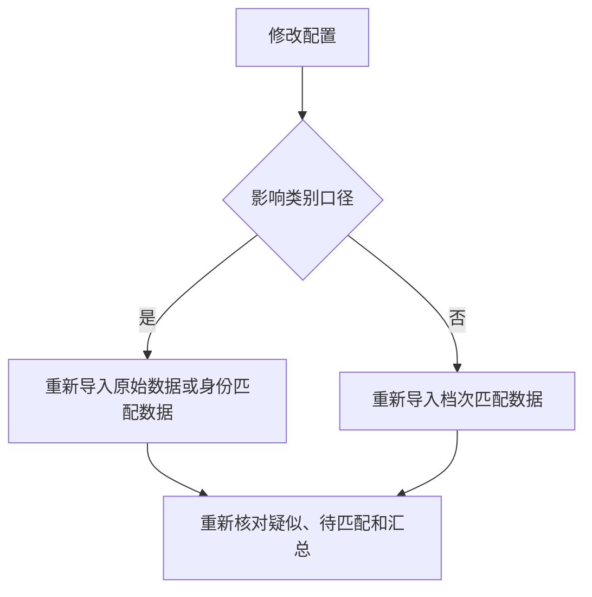

# 数据核实业务流程图解

## 总流程

```mermaid
flowchart TD
    A["维护类别转换配置"] --> B["维护年度参保档次配置"]
    B --> C["导入参保原始数据"]
    C --> D["转换代缴类别口径"]
    D --> E["匹配年度参保档次"]
    E --> F["导入档次匹配数据"]
    F --> G["导入救助身份和认定区数据"]
    G --> H["处理待匹配和疑似数据"]
    H --> I["导出匹配结果"]
    I --> J["税务与参保汇总核对"]
```

## 类别转换

```mermaid
flowchart TD
    A["导入值"] --> B{"精确命中税务口径"}
    B -- "是" --> E["返回税务代缴数据口径"]
    B -- "否" --> C{"精确命中医保导出口径"}
    C -- "是" --> E
    C -- "否" --> D{"精确命中国家字典名称"}
    D -- "是" --> E
    D -- "否" --> F["未匹配"]
```

## 配置变更

```mermaid
flowchart TD
    A["修改配置"] --> B{"影响类别口径"}
    B -- "是" --> C["重新导入原始数据或身份匹配数据"]
    B -- "否" --> D["重新导入档次匹配数据"]
    C --> E["重新核对疑似、待匹配和汇总"]
    D --> E
```
