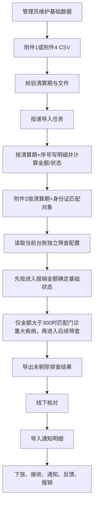
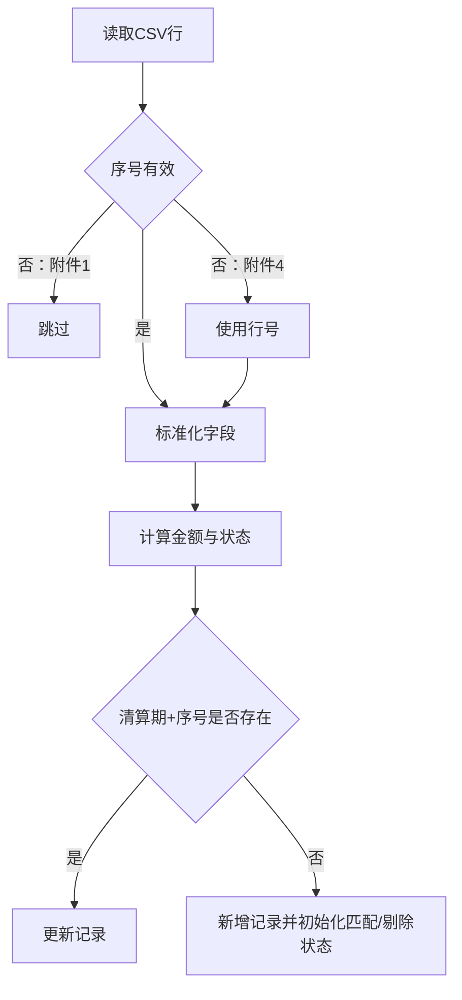
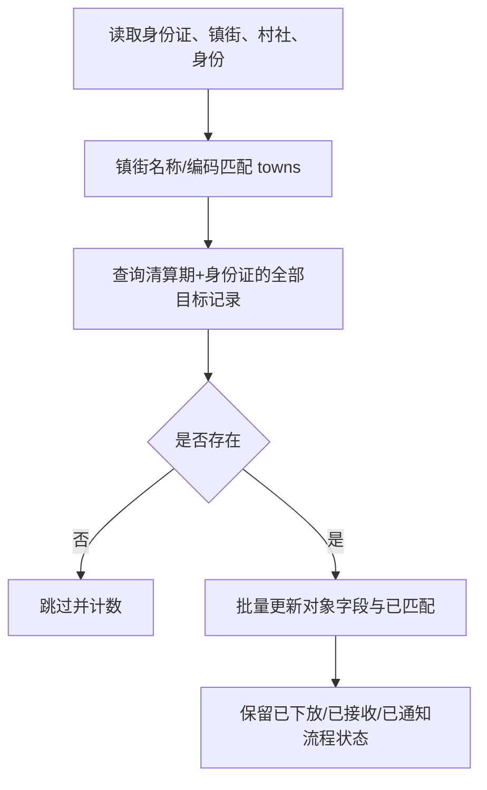
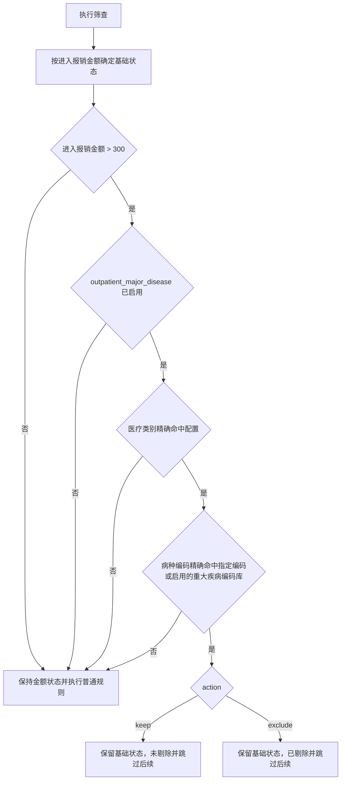
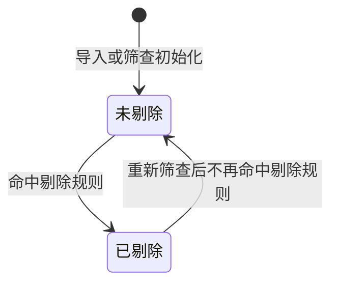
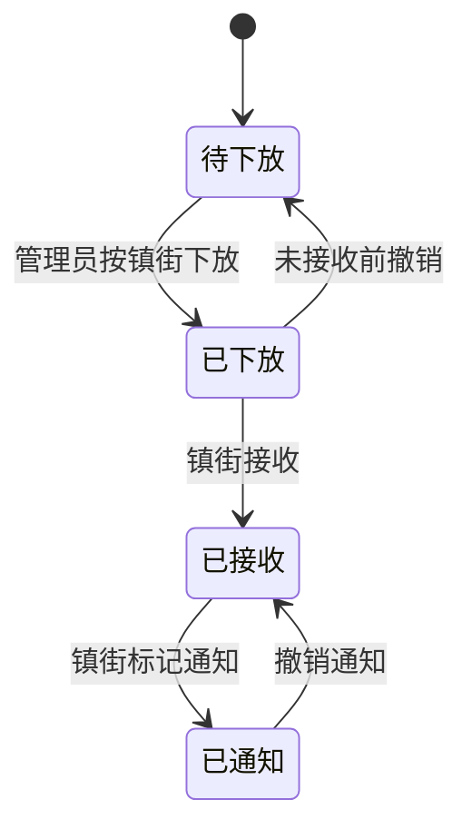
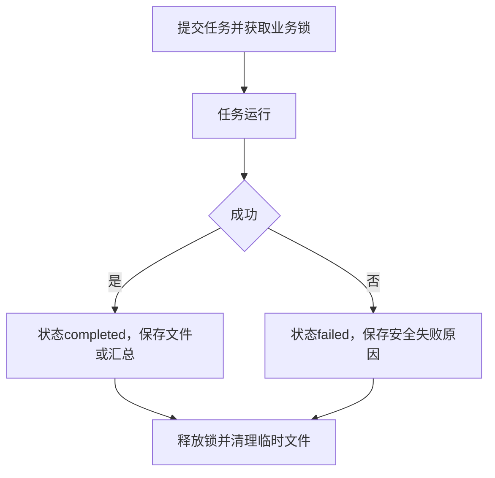

# 未救助台账业务流程图解

## 总流程

```mermaid
flowchart TD
    A["管理员维护基础数据"] --> B["附件1或附件4 CSV"]
    B --> C["校验清算期与文件"]
    C --> D["投递导入任务"]
    D --> E["按清算期+序号写明细并计算金额/状态"]
    E --> F["附件2按清算期+身份证匹配对象"]
    F --> G["读取当前台账独立筛查配置"]
    G --> H["先按进入报销金额确定基础状态"]
    H --> I["仅金额大于300时匹配门诊重大疾病，再进入后续筛查"]
    I --> J["导出未剔除排查结果"]
    J --> K["线下核对"]
    K --> L["导入通知明细"]
    L --> M["下放、接收、通知、反馈、报销"]
```

## 导入幂等语义

```mermaid
flowchart TD
    A["读取CSV行"] --> B{"序号有效"}
    B -- "否：附件1" --> C["跳过"]
    B -- "否：附件4" --> D["使用行号"]
    B -- "是" --> E["标准化字段"]
    D --> E
    E --> F["计算金额与状态"]
    F --> G{"清算期+序号是否存在"}
    G -- "是" --> H["更新记录"]
    G -- "否" --> I["新增记录并初始化匹配/剔除状态"]
```

## 附件2匹配

```mermaid
flowchart TD
    A["读取身份证、镇街、村社、身份"] --> B["镇街名称/编码匹配 towns"]
    B --> C["查询清算期+身份证的全部目标记录"]
    C --> D{"是否存在"}
    D -- "否" --> E["跳过并计数"]
    D -- "是" --> F["批量更新对象字段与已匹配"]
    F --> G["保留已下放/已接收/已通知流程状态"]
```

## 筛查固定首项规则

```mermaid
flowchart TD
    A["执行筛查"] --> B["按进入报销金额确定基础状态"]
    B --> C{"进入报销金额 > 300"}
    C -- "否" --> H["保持金额状态并执行普通规则"]
    C -- "是" --> D{"outpatient_major_disease 已启用"}
    D -- "否" --> H
    D -- "是" --> E{"医疗类别精确命中配置"}
    E -- "否" --> H
    E -- "是" --> F{"病种编码精确命中指定编码或启用的重大疾病编码库"}
    F -- "否" --> H
    F -- "是" --> G{"action"}
    G -- "keep" --> I["保留基础状态，未剔除并跳过后续"]
    G -- "exclude" --> J["保留基础状态，已剔除并跳过后续"]
```

未救助明细使用未救助配置，应补应退明细使用应补应退配置；两边保存、读取和执行互不串用。

## 筛查状态

```mermaid
stateDiagram-v2
    [*] --> 未剔除: 导入或筛查初始化
    未剔除 --> 已剔除: 命中剔除规则
    已剔除 --> 未剔除: 重新筛查后不再命中剔除规则
```

## 通知状态

```mermaid
stateDiagram-v2
    [*] --> 待下放
    待下放 --> 已下放: 管理员按镇街下放
    已下放 --> 待下放: 未接收前撤销
    已下放 --> 已接收: 镇街接收
    已接收 --> 已通知: 镇街标记通知
    已通知 --> 已接收: 撤销通知
```

`reimbursement_status` 独立在未报销/已报销之间转换，并同步 `reimbursed_at`。

## 异步任务异常

```mermaid
flowchart TD
    A["提交任务并获取业务锁"] --> B["任务运行"]
    B --> C{"成功"}
    C -- "是" --> D["状态completed，保存文件或汇总"]
    C -- "否" --> E["状态failed，保存安全失败原因"]
    D --> F["释放锁并清理临时文件"]
    E --> F
```
