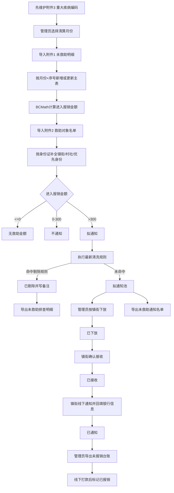
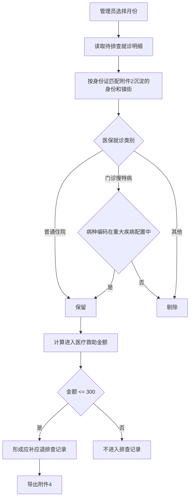

# 未救助明细台账业务逻辑与流程图

> 本模块为新业务功能，只复用平台用户、角色、权限、任务中心、导入导出等底座能力；主业务数据不依赖既有参保台账、医疗救助受理、统计汇总、优抚联网结算业务表。

## 1. 我对业务需求的理解

未救助明细台账的核心目标是：先维护救助重大疾病编码等基础配置，再按清算月份导入医保侧提供的“未救助明细”，再导入救助对象名单补全姓名、镇街、村社和身份，系统计算每条记录是否存在可能需要通知/补报的救助金额；管理员可按规则清洗、下放到镇街；镇街人员接收、通知群众并回填银行账户；最终形成排查明细、通知名单、未报销台账和独立的应补应退排查记录。

业务闭环如下：

1. 区级管理员先导入或维护附件3“救助重大疾病编码”，完成重大疾病字典配置。
2. 区级管理员按月份导入附件1“未救助明细”。
3. 系统以 `清算期 + 序号` 作为业务匹配键，新增或更新未救助主表；序号至少保证同一导入年月唯一，可能全局唯一。
4. 系统按公式计算 `进入报销金额 = 医保政策范围费用 - 统筹报销金额 - 大额报销 - 大病报销`，金额使用 BCMath 保留 2 位。
5. 区级管理员导入附件2“救助对象名单”，不单独落表。
6. 系统按 `身份证号` 匹配当前月份主表中同人多条记录，补全 `姓名(仅当附件1姓名为空或为 -- 时)`、`镇街`、`村社`、`优先身份`。
7. 系统根据进入报销金额判定基础状态：`<=0` 为无救助金额，`0-300` 为不通知，`>300` 为拟通知。
8. 管理员导出“医疗救助未报销台账”前，系统展示并执行最新清洗规则；规则可编辑、保存为 JSON 版本。
9. 清洗后符合条件的数据保留为拟通知池，被剔除数据标记 `已剔除` 并写入剔除原因。
10. 管理员按镇街下放拟通知数据，状态变为 `已下放`。
11. 镇街账号登录后查看本镇街数据，首次确认接收后状态变为 `已接收`。
12. 镇街线下通知群众并在系统标记 `已通知`，同时回填开户行、户名、账号。
13. 管理员导出未报销台账用于财务拨款，导出范围只需排除已剔除数据，并可手动标记 `已报销`。
14. 附件4“应补应退排查记录”为独立排查结果：按附件2导入后沉淀在主表中的身份和镇街匹配对象，筛选普通住院和符合重大疾病编码的门诊慢特病，计算每条记录的进入医疗救助金额并导出名单；本期不新增附件4导入模板。

## 2. 角色与数据边界

### 区级管理员

- 导入附件1、附件2、附件3。
- 配置/编辑清洗规则。
- 查看全量数据。
- 执行清洗、导出四类附件。
- 按镇街下放数据。
- 标记报销状态。
- 执行删除、标记、下放、导出等重要操作时，需要二次确认。

### 镇街人员

- 仅查看下放到本镇街的数据。
- 确认接收下放名单。
- 标记群众已通知。
- 回填开户行、户名、银行账号。
- 可导出本镇街通知/回填相关数据，是否开放由权限控制。

### 数据隔离

当前平台 `users` 表没有镇街字段。新模块确认新增镇街组织表 `towns`，并在用户表增加 `town_id`。用户管理里镇街为非必选；有镇街归属的账号访问业务数据时按镇街隔离，无镇街归属的区级/全局账号不做镇街隔离。镇街本身需要列表、新增、编辑、删除能力，并纳入角色权限控制。

## 3. 状态机

### 主状态 `status`

| 状态 | 触发条件 | 说明 |
| :--- | :--- | :--- |
| 待处理 | 附件1导入后尚未完成附件2匹配或重算 | 初始状态 |
| 无救助金额 | 进入报销金额 <= 0 | 无需通知 |
| 不通知 | 0 < 进入报销金额 <= 300 | 金额未达通知阈值 |
| 拟通知 | 进入报销金额 > 300，且通过基础匹配 | 待清洗/待下放池 |
| 已下放 | 管理员下放到镇街 | 镇街可见 |
| 已接收 | 镇街首次确认接收 | 证明镇街已看到名单 |
| 已通知 | 镇街完成线下通知并标记 | 可回填账户 |

### 辅助状态

| 字段 | 值 | 说明 |
| :--- | :--- | :--- |
| `exclude_status` | 未剔除、已剔除 | 清洗规则结果 |
| `reimbursement_status` | 未报销、已报销 | 管理员打款/报销标记 |

## 4. 金额计算

### 附件1主表进入报销金额

公式：

```text
进入报销金额 = 医保政策范围费用 - 统筹报销金额 - 大额报销 - 大病报销
```

说明：

- 附件1没有医疗救助金额和渝快保报销金额，因此主表这条链路不扣减这两项。
- 所有金额计算必须使用 BCMath，统一保留 2 位小数。

### 附件4应补应退进入医疗救助金额

公式：

```text
进入医疗救助金额 = 医保政策范围内费用 - 统筹报销金额 - 大额报销金额 - 大病报销金额 - 医疗救助金额 - 渝快保报销金额
```

说明：

- 医疗救助金额、渝快保报销金额没有值时按 0 处理。
- 附件4一人可多条，不按人聚合，不冲减历史救助金额。
- 附件4与附件1主表是独立排查结果，但身份、镇街匹配依据附件2导入后沉淀在主表中的对象信息，病种筛选依据附件3重大疾病编码。

## 5. 清洗规则

清洗规则存储在配置表，使用 JSON 版本保存。每次导出未报销台账时读取最新有效规则，可预览、编辑、确认后执行。

默认规则：

| 规则 | 处理 | 默认备注 |
| :--- | :--- | :--- |
| 医疗类别不属于普通住院、住院双通道外购药、儿童两病住院 | 剔除 | 门诊救助 |
| 医药机构名称包含诊所、药店、卫生室 | 剔除 | 对象类别不符 |
| 统筹报销金额 = 医保政策范围费用 | 剔除 | 无救助金额 |
| 大额报销 = 医保政策范围费用 | 剔除 | 无救助金额 |
| 大病报销 = 医保政策范围费用 | 剔除 | 无救助金额 |
| 已使用普通住院救助金额 >= 6000 | 剔除 | 无救助额度 |
| 已使用重特大疾病救助金额 >= 100000 | 剔除 | 无救助额度 |
| 已使用大额费用住院救助 >= 60000 | 剔除 | 无救助额度 |
| 身份为返贫致贫人口、低保边缘家庭成员、因病致贫重病患者、脱贫不稳定户、边缘易致贫户、突发严重困难户 | 剔除 | 对象类别不符 |

建议规则 JSON 结构：

```json
{
  "version": "202605240001",
  "rules": [
    {
      "code": "medical_category_allow",
      "name": "医疗类别保留",
      "enabled": true,
      "field": "medical_category",
      "operator": "in",
      "values": ["普通住院", "住院双通道外购药", "儿童两病住院"],
      "action": "keep_other_exclude",
      "remark": "门诊救助"
    }
  ]
}
```

## 6. 总流程图



## 7. 附件4独立流程图



## 8. 导出清单

| 导出 | 数据来源 | 数据范围 |
| :--- | :--- | :--- |
| 附件1 医疗救助未救助排查明细 | 主表 + 附件2补全字段 + 清洗结果 | 全量或命中剔除/排查范围，含备注 |
| 附件2 医疗救助未报销台账 | 主表中排除已剔除的数据 | 含银行账户信息，用于财务拨款 |
| 附件3 医疗救助未救助通知名单 | 清洗后拟通知/下放数据 | 给镇街通知群众 |
| 附件4 医疗救助应补应退排查记录 | 独立就诊明细排查表 | 普通住院和符合重大疾病编码的门诊慢特病 |

## 9. 已确认口径

1. 附件1 `序号` 至少按导入年月唯一，系统按 `清算期 + 序号` 做业务匹配，代码校验重复，不建唯一索引。
2. 主状态统一使用“拟通知”，不再使用“待通知”。
3. 不建立 `assistance_name` 字段；附件1姓名为空或为 `--` 时，用附件2姓名补充到主表 `name`。
4. 附件2救助对象名单不单独落表，导入后直接更新当月主表。
5. 新增 `towns` 和 `users.town_id`，镇街账号按归属镇街做数据隔离，区级/全局账号不隔离。
6. 所有导入、导出均走任务中心；每个导入功能需提供模板文件。
7. 删除、标记、下放、导出等重要操作都需要二次确认。
8. 新增全平台操作日志表，未救助模块优先完整接入。
