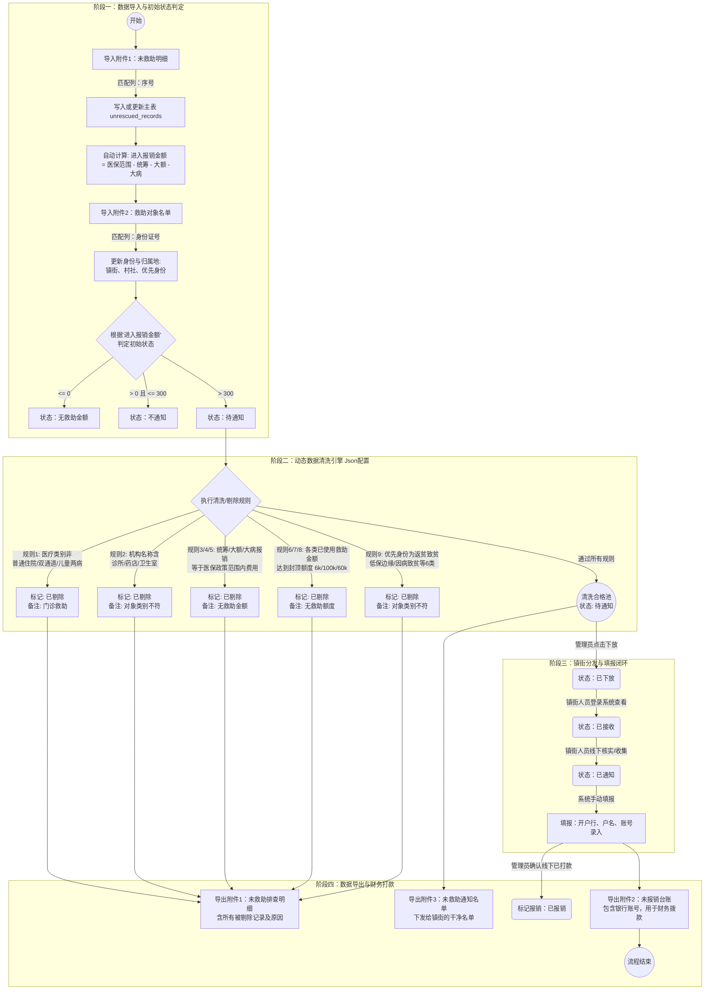

# 未救助明细台账 - 完整业务流程与逻辑扭转图

本文档详细梳理了“未救助明细台账”从数据导入、清洗、分发到最终导出台账打款的完整生命周期。

## 一、 核心逻辑扭转图 (Mermaid)

---

## 二、 数据处理细节与规则说明

### 1. 金额计算规范 (使用 BCMath)
所有涉及费用的加减操作（如 `进入报销金额`）必须使用 PHP 提供的 `BCMath` 函数库进行高精度运算，并统一保留 **2位小数**。

### 2. 清洗规则的动态存储
文档中要求“剔除规则的每一项都可以由用户添加、编辑、删除”，因此这 9 条规则在系统初始化时会转为标准 JSON 格式存入 `unrescued_wash_config` 表中。在点击“导出医疗救助未报销台账”时，系统实时读取最新的 Json 规则对数据进行过滤标记，而不是写死在代码里。

### 3. 数据状态流转汇总
一条明细数据在系统中的生命周期状态 (`status`) 包含：
- **待处理**：导入后尚未计算匹配。
- **无救助金额 / 不通知**：因金额不达标在导入阶段即被过滤拦截。
- **待通知**：金额达标，且顺利通过清洗规则引擎。
- **已下放**：区级管理员将权限移交给对应镇街。
- **已接收**：镇街确认收到名单。
- **已通知**：镇街完成群众线下通知与资料收集。

附加状态：
- **剔除状态**：`未剔除` / `已剔除`
- **报销状态**：`未报销` / `已报销`
