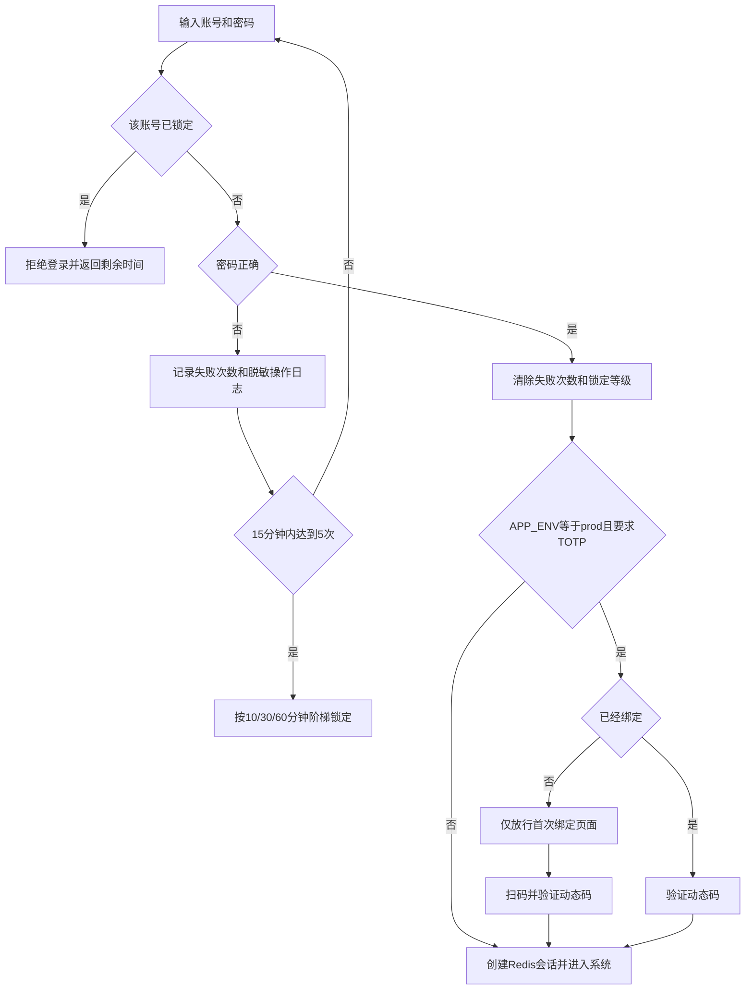
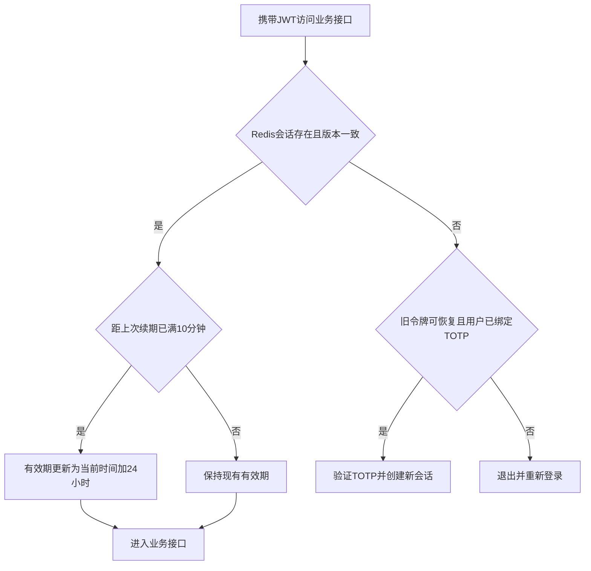
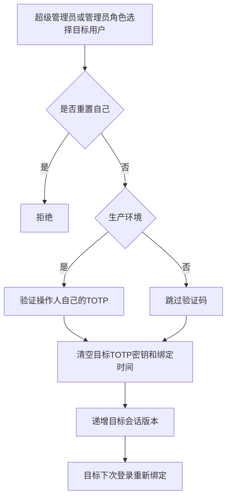
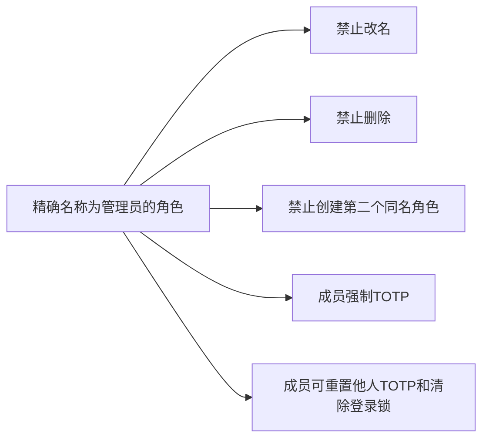

# 系统用户管理业务流程图解

## 登录、锁定与 TOTP

```mermaid
flowchart TD
    A["输入账号和密码"] --> B{"该账号已锁定"}
    B -- "是" --> C["拒绝登录并返回剩余时间"]
    B -- "否" --> D{"密码正确"}
    D -- "否" --> E["记录失败次数和脱敏操作日志"]
    E --> F{"15分钟内达到5次"}
    F -- "是" --> G["按10/30/60分钟阶梯锁定"]
    F -- "否" --> A
    D -- "是" --> H["清除失败次数和锁定等级"]
    H --> I{"APP_ENV等于prod且要求TOTP"}
    I -- "否" --> J["创建Redis会话并进入系统"]
    I -- "是" --> K{"已经绑定"}
    K -- "否" --> L["仅放行首次绑定页面"]
    L --> M["扫码并验证动态码"]
    M --> J
    K -- "是" --> N["验证动态码"]
    N --> J
```

## 活动续期与过期恢复

```mermaid
flowchart TD
    A["携带JWT访问业务接口"] --> B{"Redis会话存在且版本一致"}
    B -- "是" --> C{"距上次续期已满10分钟"}
    C -- "是" --> D["有效期更新为当前时间加24小时"]
    C -- "否" --> E["保持现有有效期"]
    D --> F["进入业务接口"]
    E --> F
    B -- "否" --> G{"旧令牌可恢复且用户已绑定TOTP"}
    G -- "是" --> H["验证TOTP并创建新会话"]
    G -- "否" --> I["退出并重新登录"]
```

## 管理员重置 TOTP

```mermaid
flowchart TD
    A["超级管理员或管理员角色选择目标用户"] --> B{"是否重置自己"}
    B -- "是" --> C["拒绝"]
    B -- "否" --> D{"生产环境"}
    D -- "是" --> E["验证操作人自己的TOTP"]
    D -- "否" --> F["跳过验证码"]
    E --> G["清空目标TOTP密钥和绑定时间"]
    F --> G
    G --> H["递增目标会话版本"]
    H --> I["目标下次登录重新绑定"]
```

## 角色保护

```mermaid
flowchart LR
    A["精确名称为管理员的角色"] --> B["禁止改名"]
    A --> C["禁止删除"]
    A --> D["禁止创建第二个同名角色"]
    A --> E["成员强制TOTP"]
    A --> F["成员可重置他人TOTP和清除登录锁"]
```
