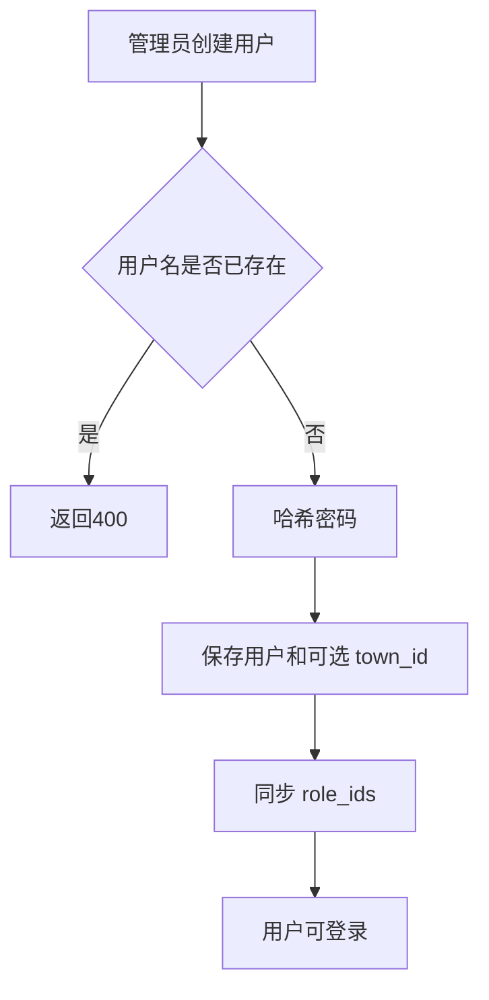
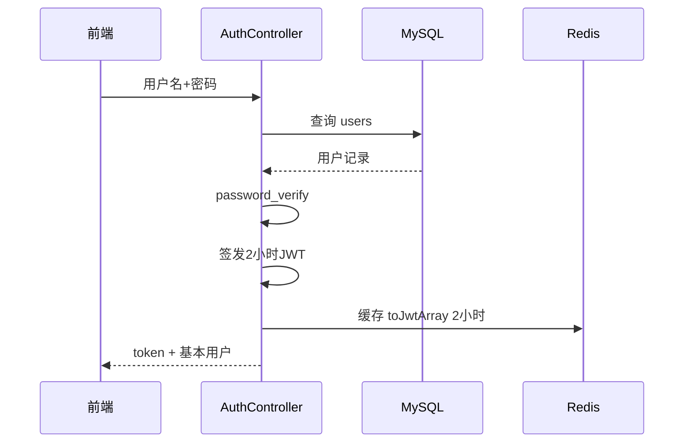
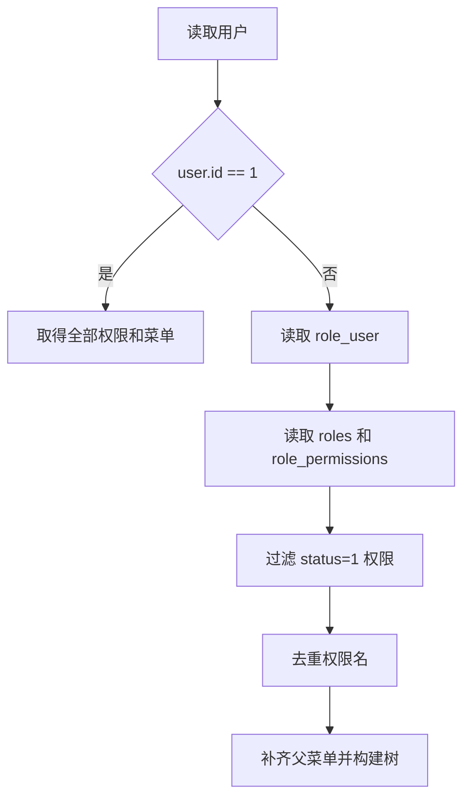
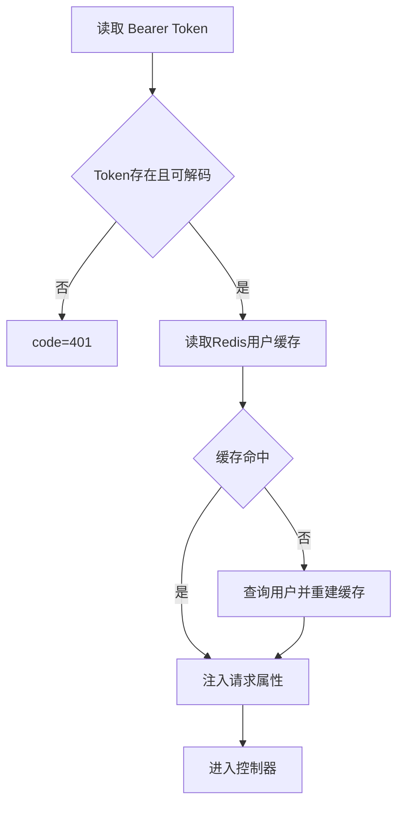
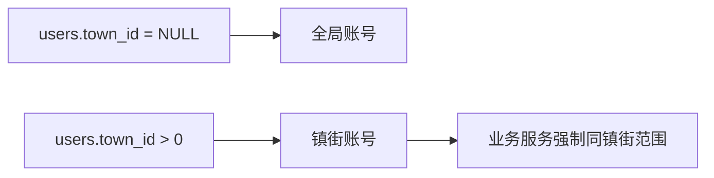

# 系统用户管理业务流程图解

## 账号配置

```mermaid
flowchart TD
    A["管理员创建用户"] --> B{"用户名是否已存在"}
    B -- "是" --> C["返回400"]
    B -- "否" --> D["哈希密码"]
    D --> E["保存用户和可选 town_id"]
    E --> F["同步 role_ids"]
    F --> G["用户可登录"]
```

## 登录认证

```mermaid
sequenceDiagram
    participant F as 前端
    participant A as AuthController
    participant D as MySQL
    participant R as Redis
    F->>A: 用户名+密码
    A->>D: 查询 users
    D-->>A: 用户记录
    A->>A: password_verify
    A->>A: 签发2小时JWT
    A->>R: 缓存 toJwtArray 2小时
    A-->>F: token + 基本用户
```

## 权限汇总

```mermaid
flowchart TD
    A["读取用户"] --> B{"user.id == 1"}
    B -- "是" --> C["取得全部权限和菜单"]
    B -- "否" --> D["读取 role_user"]
    D --> E["读取 roles 和 role_permissions"]
    E --> F["过滤 status=1 权限"]
    F --> G["去重权限名"]
    G --> H["补齐父菜单并构建树"]
```

## 请求认证

```mermaid
flowchart TD
    A["读取 Bearer Token"] --> B{"Token存在且可解码"}
    B -- "否" --> C["code=401"]
    B -- "是" --> D["读取Redis用户缓存"]
    D --> E{"缓存命中"}
    E -- "否" --> F["查询用户并重建缓存"]
    E -- "是" --> G["注入请求属性"]
    F --> G
    G --> H["进入控制器"]
```

## 镇街范围

```mermaid
flowchart LR
    A["users.town_id = NULL"] --> B["全局账号"]
    C["users.town_id > 0"] --> D["镇街账号"]
    D --> E["业务服务强制同镇街范围"]
```

