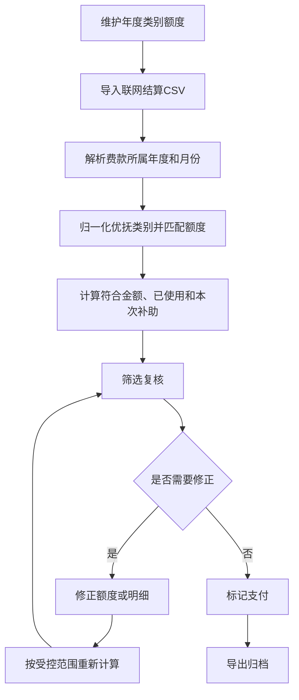
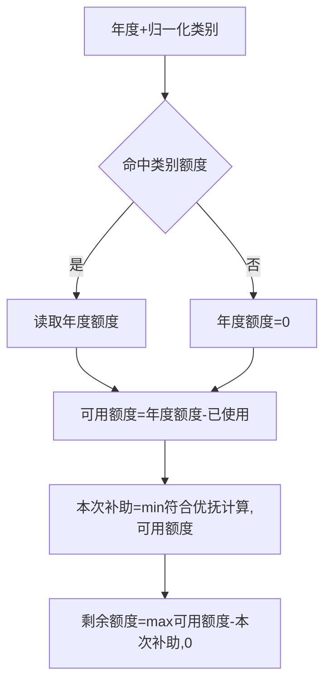
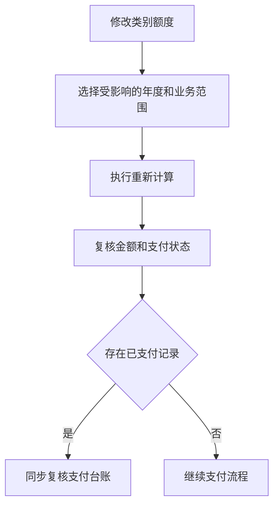

# 联网结算业务流程图解

## 总流程

```mermaid
flowchart TD
    A["维护年度类别额度"] --> B["导入联网结算CSV"]
    B --> C["解析费款所属年度和月份"]
    C --> D["归一化优抚类别并匹配额度"]
    D --> E["计算符合金额、已使用和本次补助"]
    E --> F["筛选复核"]
    F --> G{"是否需要修正"}
    G -- "是" --> H["修正额度或明细"]
    H --> I["按受控范围重新计算"]
    I --> F
    G -- "否" --> J["标记支付"]
    J --> K["导出归档"]
```

## 额度计算

```mermaid
flowchart TD
    A["年度+归一化类别"] --> B{"命中类别额度"}
    B -- "否" --> C["年度额度=0"]
    B -- "是" --> D["读取年度额度"]
    D --> E["可用额度=年度额度-已使用"]
    C --> E
    E --> F["本次补助=min符合优抚计算,可用额度"]
    F --> G["剩余额度=max可用额度-本次补助,0"]
```

## 配置变更

```mermaid
flowchart TD
    A["修改类别额度"] --> B["选择受影响的年度和业务范围"]
    B --> C["执行重新计算"]
    C --> D["复核金额和支付状态"]
    D --> E{"存在已支付记录"}
    E -- "是" --> F["同步复核支付台账"]
    E -- "否" --> G["继续支付流程"]
```
